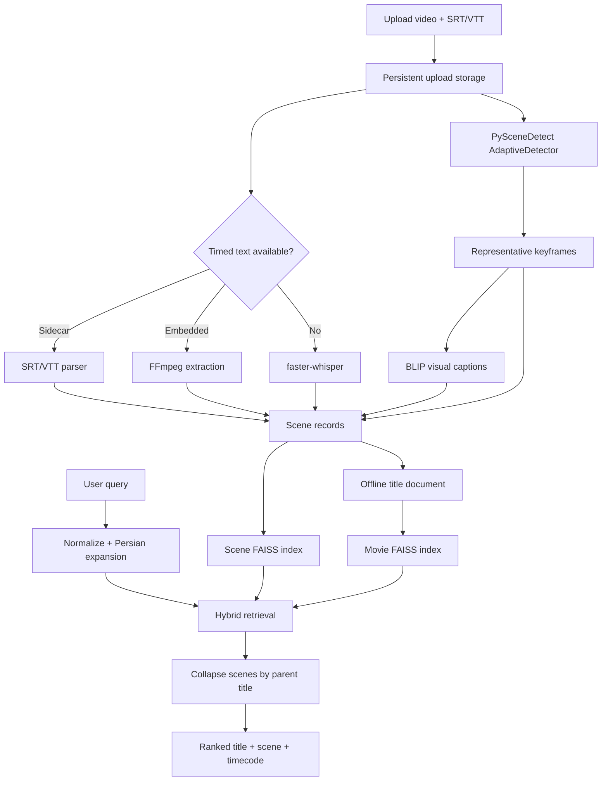

# CineScene Architecture

## Retrieval Contract

The primary user story is: **given a description of a remembered scene, return the correct movie or episode and the best matching timestamp.** CineScene models a title as a hierarchy instead of one long plot string.

```text
Title document
  +-- plot, genres, cast, director, mood, keywords
  +-- Scene 001: 00:00-00:14, dialogue, visual caption, tags, keyframe
  +-- Scene 002: 00:14-00:31, dialogue, visual caption, tags, keyframe
  +-- ...
```

## Data Flow



## Ingestion

`ingestion/offline_video.py` owns scene boundaries and the persisted scene contract.

- Uses PySceneDetect `AdaptiveDetector` when installed.
- Falls back to OpenCV histogram, pixel-difference, motion, and contrast signals.
- Enforces minimum and maximum scene duration to prevent noisy micro-cuts or very long segments.
- Persists a representative frame and rich record for every scene.
- Parses movie and `SxxExx` series identities and removes release tags from filenames.
- Recovers the offline catalog from persisted scene JSON if catalog files are stale.

`ingestion/media_intelligence.py` owns optional media models.

- FFmpeg discovers and extracts an embedded subtitle stream.
- SRT/VTT sidecars are merged into scene time ranges.
- faster-whisper generates timed dialogue when no subtitle track exists.
- BLIP generates a natural-language caption from each keyframe.
- Capability discovery keeps optional models observable from the System screen.

Each `SceneRecord` contains:

```text
parent video id, title, scene number, start/end/duration
transcript, subtitle sources
visual caption, caption source
mood tags, keywords, visual tags
brightness, motion, contrast, cut strength
keyframe path, source video path, analysis version
```

## Indexes

### Movie index

`build_index_v2.py` embeds complete title documents. It provides broad recall for plot, cast, genre, director, and overall mood queries.

### Scene index

`scene_index.py` embeds every persisted scene independently. Its text includes the current transcript and visual caption plus local dialogue context from adjacent scenes. Metadata retains the parent title id, timestamp, and keyframe.

The scene builder reads the active movie-index model so vector dimensions always match. Index files are written separately:

```text
data/index/movies.index
data/index/metadata.pkl
data/index/scenes.index
data/index/scene_metadata.pkl
```

## Ranking

`hybrid_search.py` loads both indexes into one retrieval engine.

1. Normalize and expand the query in `query_processor.py`.
2. Search movie vectors and scene vectors.
3. Add lexical evidence from title, plot, scene transcript, captions, tags, and metadata.
4. Prefer transcript overlap for dialogue-like scene queries.
5. Collapse multiple scene hits to one movie or episode.
6. Preserve the best scene and a short list of additional matching scenes.
7. Return a stable ranked response with title score, scene score, frame, and timecode.

The output is parent-title oriented, so ten matching moments from one movie do not occupy ten result cards.

## API And Jobs

`backend/main.py` exposes:

| Route | Purpose |
| --- | --- |
| `GET /api/health` | Model, CUDA, movie index, scene index, and crawler diagnostics |
| `POST /api/search` | Hybrid scene-to-title retrieval |
| `POST /api/ingest/video` | Chunked multipart video/subtitle upload |
| `POST /api/crawl/offline-async` | Recursive local-folder ingestion |
| `GET /api/crawl/status` | Documents, scenes, keyframes, and capabilities |
| `GET /api/jobs/{id}` | Background pipeline progress |
| `POST /api/index/rebuild` | Full movie and scene index rebuild |
| `/media/videos/*` | Local source playback for authorized ingestions |
| `/media/keyframes/*` | Scene frame delivery |

Uploads are size-limited, streamed to disk, and analyzed in a background job. A successful ingestion refreshes the scene index and clears the cached search engine so the title is searchable without restarting the app.

Embedding-model creation is protected by a process-wide re-entrant lock. Health checks and searches therefore cannot cold-load two copies of BGE-large concurrently after an index refresh, which is important on a 4 GB GPU.

## Frontend

The backend-connected app in `frontend/` contains four workspaces:

- **Discover:** scene query, ranked results, keyframes, timestamps, and local scene playback.
- **Scene Lab:** drag/drop upload, subtitle tracks, analysis profiles, progress, and processed timeline.
- **Library:** persistent history, favorites, and ingestion records.
- **System:** runtime capabilities and index diagnostics.

The public `docs/` build shares the visual language and browser memory but is intentionally static. GitHub Pages cannot execute the Python/GPU pipeline.

## Storage And Recovery

- SQLite stores user memory and ingestion history.
- Source media and generated model data are ignored by Git.
- Scene JSON files are the durable recovery source for offline documents.
- Movie and scene indexes can be regenerated from catalog and scene records.
- The crawler never requires access to a protected streaming player or DRM bypass.
