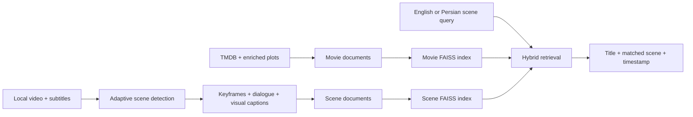

# CineScene

**Scene-to-title retrieval for movies and series.** Describe a scene, line of dialogue, visual detail, or mood and CineScene returns the most likely title together with the matching scene, timestamp, transcript, and keyframe.

[Open the installable PWA](https://aminhatesprogramming.github.io/cinescene) | [Architecture](ARCHITECTURE.md) | [Demo guide](FINAL_DEMO_GUIDE.md)

## Why CineScene

Traditional movie search depends on titles, actors, or exact keywords. CineScene builds a searchable memory of each film at two levels:

- one embedding for the complete movie or episode;
- one embedding for every detected scene.

The runtime combines both FAISS indexes with lexical evidence, Persian query expansion, metadata signals, and result collapsing. A user can therefore search for a remembered moment instead of knowing the movie name.

## Feature Set

- Semantic retrieval across 7,615 indexed titles, including 2,810 public series records.
- Separate scene index with timestamp-level matches.
- In-app drag-and-drop upload for video and multiple SRT/VTT files.
- Recursive movie and series folder crawler.
- PySceneDetect adaptive cut detection with an OpenCV fallback.
- FFmpeg extraction of embedded subtitle streams.
- `faster-whisper` speech-to-text when subtitles are unavailable.
- BLIP keyframe captions for visual scene understanding.
- Automatic catalog and scene-index refresh after ingestion.
- Movie/series filename parsing, including `S01E01` metadata.
- Persian and English scene queries.
- Search history, favorites, relevance feedback, and SQLite persistence.
- Responsive frontend, local media playback, and an installable public PWA.

## Architecture



See [ARCHITECTURE.md](ARCHITECTURE.md) for component and data-contract details.

## Run The Full Studio

```powershell
python -m venv .venv
.\.venv\Scripts\python.exe -m pip install -r requirements.txt
.\.venv\Scripts\python.exe app.py
```

Open `http://127.0.0.1:8000`.

The first screen is the working retrieval interface. Open **Scene Lab** to upload a video, attach subtitles, choose the analysis profile, and watch the pipeline progress from upload to searchable scene vectors.

## Use Scene Lab

1. Drop an MP4, MKV, MOV, AVI, or WEBM file into **Media source**.
2. Optionally attach one or more SRT/VTT subtitle tracks.
3. Keep **Embedded subtitles** enabled for MKV subtitle extraction.
4. Enable **Speech transcription** when the media has no subtitles.
5. Enable **Visual captioning** for BLIP-based keyframe descriptions.
6. Select **Analyze and index video**.
7. Search for a line, action, object, lighting condition, or mood in **Discover**.

Ingestion is a background job. The UI reports upload progress, scene detection, media intelligence, vector indexing, and the final scene timeline. A full movie-index rebuild is not required after an upload because the independent scene index refreshes automatically.

## Offline Pipeline

```text
video upload or local folder
  -> persistent media storage
  -> adaptive scene boundaries
  -> representative keyframe per scene
  -> sidecar / embedded subtitles
  -> optional faster-whisper transcript
  -> optional BLIP visual caption
  -> mood, keyword, motion, light, and contrast signals
  -> scene JSON + offline catalog document
  -> scene FAISS index
  -> hybrid scene-to-title retrieval
```

Generated local data:

```text
data/offline_videos/uploads/
data/processed/video_ingestion/*_scenes.json
data/processed/video_ingestion/keyframes/
data/processed/offline_media_enriched.json
data/processed/cinescene_catalog.json
data/index/movies.index
data/index/scenes.index
```

## Folder Crawler

Scene Lab also accepts a local folder path for batch ingestion. The CLI equivalent is:

```powershell
.\.venv\Scripts\python.exe .\scripts\crawl_offline_videos.py "D:\Series" --min-scene-sec 4 --max-scene-sec 45 --threshold 0.35 --sample-fps 2
```

Recommended series naming:

```text
Show.Name.S01E01.mkv
Show.Name.S01E01.fa.srt
Show.Name.S01E01.en.srt
```

## Retrieval Model

The strongest bundled encoder is `BAAI/bge-large-en-v1.5` (1024 dimensions). Training triplets are generated with positive relations and mined hard negatives, then fine-tuned with `MultipleNegativesRankingLoss` and curriculum stages.

```powershell
.\.venv\Scripts\python.exe build_triplets_v2.py
.\.venv\Scripts\python.exe finetune_v2.py --batch-size 4 --epochs 3
.\.venv\Scripts\python.exe build_index_v2.py --model models\bge-large-en-v1.5 --flat --batch-size 4
.\.venv\Scripts\python.exe scene_index.py
```

The small batch size is intentional for a 4 GB GTX 1650 Ti.

## Validation

```powershell
.\.venv\Scripts\python.exe .\scripts\smoke_test_final.py
.\.venv\Scripts\python.exe .\scripts\retrieval_quality_benchmark.py
node .\scripts\visual_smoke_test.js
```

The retrieval benchmark reports Hit@1, Hit@5, MRR@10, per-query rank, and latency. The visual test uses Playwright against desktop and mobile viewports and fails on browser errors or horizontal overflow.

### Verified snapshot

The final local validation on the bundled GTX 1650 Ti runtime produced:

| Check | Result |
| --- | --- |
| Catalog vectors | 7,615 |
| Scene vectors | 158 |
| Total searchable vectors | 7,773 |
| Public series imported | 2,810 |
| Encoder | BGE large, 1,024 dimensions, CUDA FP32 |
| Retrieval Hit@1 / Hit@5 | 0.90 / 1.00 |
| MRR@10 | 0.95 |
| Warm mean query latency | 0.237 seconds |
| Browser QA | Desktop and mobile, zero JS errors and zero horizontal overflow |
| Upload E2E | Video + SRT -> 3 scenes -> 3 keyframes -> rank-1 scene result |

The compact benchmark has ten deterministic regression cases and is not presented as universal accuracy. The optional cross-encoder ablation was weaker on this catalog, so reranking remains disabled by default. Reports are committed in `benchmarks/`.

## Expand The Catalog

The current index combines the enriched TMDB movie corpus with a normalized public series metadata snapshot. Rebuild or append the series portion with:

```powershell
.\.venv\Scripts\python.exe .\scripts\import_public_series_csv.py --input data\raw\tv_shows.csv
.\.venv\Scripts\python.exe .\scripts\append_catalog_to_index.py --input data\processed\tv_series_enriched.json
```

`scripts/import_tvmaze_series.py` is also available for environments with TVMaze API access. Provider metadata is treated as title-level recall; true scene retrieval still requires authorized video/subtitle ingestion through Scene Lab.

## Public PWA

The `docs/` build is published at:

```text
https://aminhatesprogramming.github.io/cinescene
```

It contains an installable app shell, browser memory, responsive scene search, local-file preview, 3,413 showcase titles, and 158 cached scene records. GitHub Pages is static hosting, so Python, FAISS, GPU inference, and server-side video ingestion run only in the FastAPI Studio or on a separately deployed Python backend.

Refresh and publish it with:

```powershell
.\.venv\Scripts\python.exe .\scripts\build_pwa_catalog.py
.\scripts\publish_github_pages.ps1
```

## Responsible Use

CineScene processes local media that the operator has permission to analyze. It does not crawl protected streaming subscriptions, bypass DRM, or redistribute source video. A production integration with a media provider must use that provider's licensed API or authorized content feed.

The public-catalog builder strips local source paths and only copies keyframes for the bundled synthetic demo titles. Additional authorized showcase media can be explicitly allowlisted with `CINESCENE_PUBLIC_MEDIA_TITLES` before running `scripts/build_pwa_catalog.py`.

## Main Components

| Path | Responsibility |
| --- | --- |
| `backend/main.py` | FastAPI routes, uploads, jobs, memory, and media URLs |
| `frontend/` | Full backend-connected Retrieval Studio |
| `ingestion/offline_video.py` | Scene detection and catalog document creation |
| `ingestion/media_intelligence.py` | FFmpeg, faster-whisper, and BLIP adapters |
| `hybrid_search.py` | Dual-index retrieval, ranking, and title collapsing |
| `scene_index.py` | Independent per-scene FAISS index builder |
| `query_processor.py` | English/Persian normalization and query expansion |
| `docs/` | Public installable PWA showcase |
| `scripts/` | Crawling, benchmarks, visual tests, and publishing |
